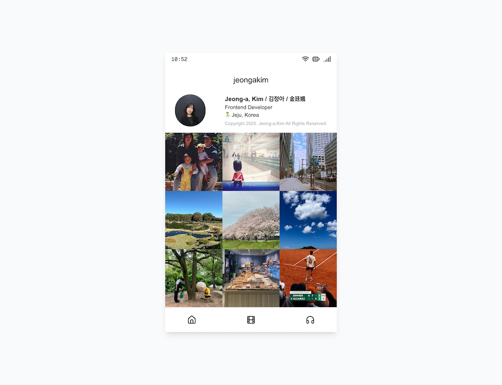

## Personal Log inspired by IG

A small Instagram-inspired personal log built with the Next.js. The home feed shows a 3×N grid of images from static data, each linking to a dedicated detail page with a description. There are also curated film and music pages to round out the profile.

## Stack
- Next.js 16 (App Router) + React 19 + TypeScript
- Tailwind CSS v4 for styling (via `@tailwindcss/postcss`)
- Lucide icons for UI chrome
- Optional: Supabase Postgres for seeding sample posts (`app/seed/route.ts`)

## Routes
- `/` – profile header and post grid pulled from `app/lib/data.ts`
- `/post/[id]` – full image and description for a single post
- `/film` – favorite film grid with hover overlays
- `/music` – embedded Spotify playlist

